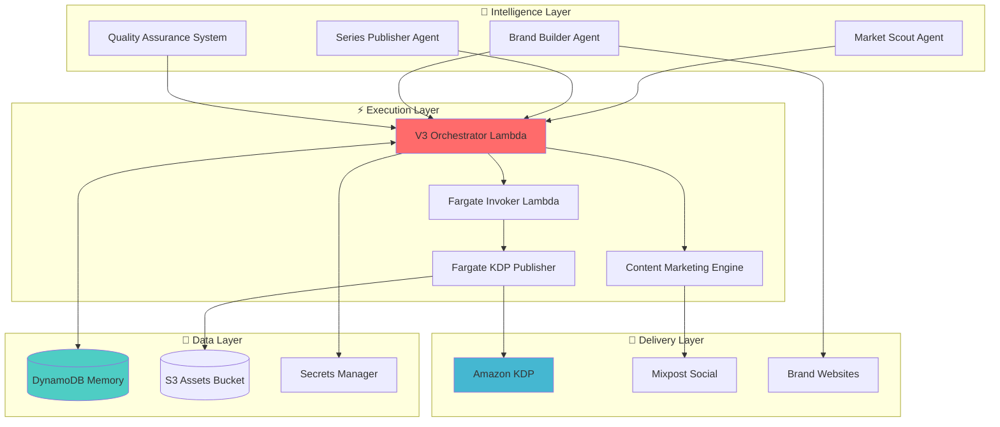
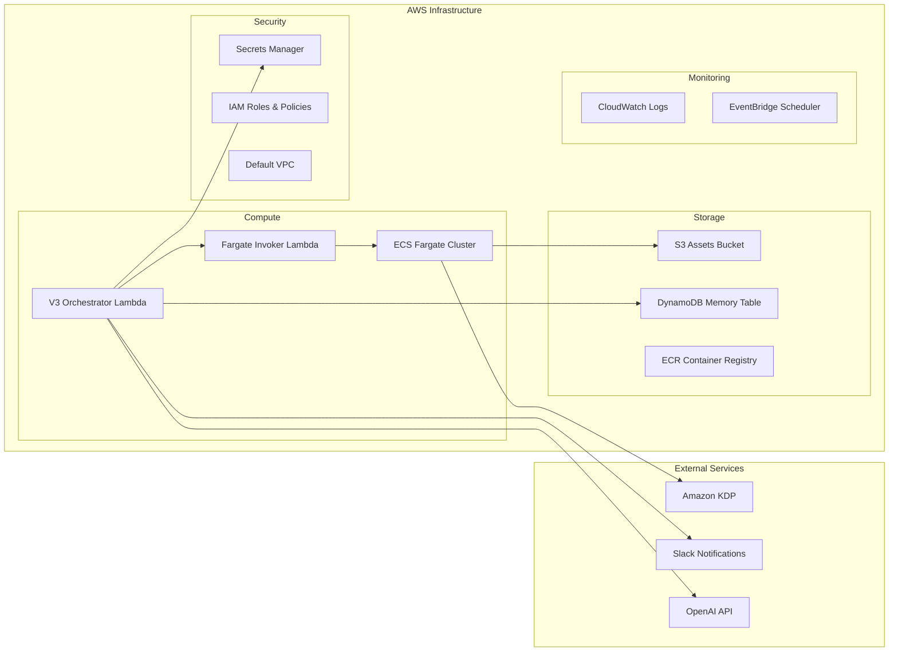
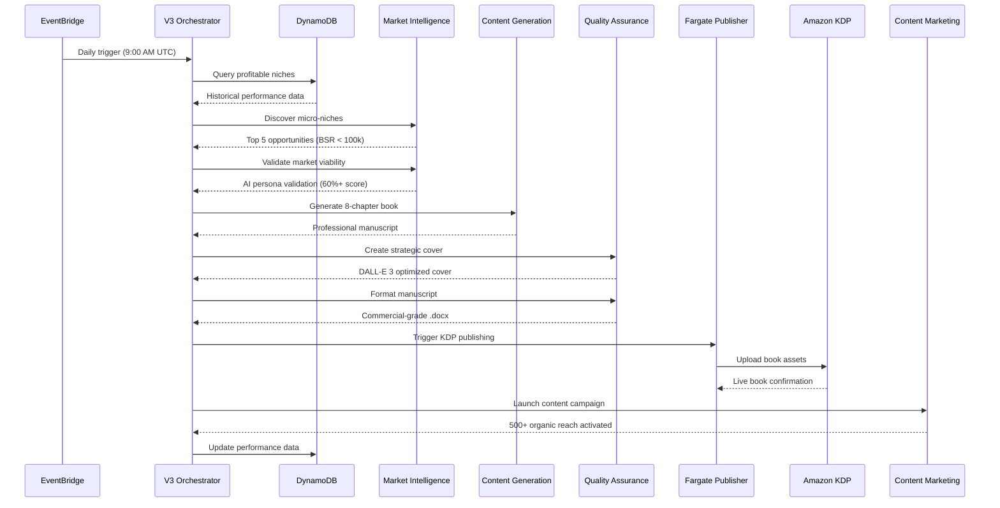

# 🚀 KindleMint V3 Zero-Touch Publishing Engine

[](https://github.com/IgorGanapolsky/ai-kindlemint-engine/actions/workflows/deploy-v3.yml)
[](https://opensource.org/licenses/MIT)
[](https://aws.amazon.com)

> **An intelligent, memory-driven publishing empire that transforms profitable micro-niches into zero-touch book series with automated KDP publishing, professional formatting, and organic marketing campaigns.**

## 🎯 Business Impact

- **$300/day revenue target** through profitable micro-niche domination
- **Zero manual intervention** - complete automation from idea to Amazon listing
- **Market intelligence** - AI-powered niche discovery and validation
- **Series strategy** - 5-book branded series for customer lifetime value multiplication
- **Organic marketing** - Content marketing engine for sustainable growth

## 📊 System Architecture



## 🏗️ Component Architecture

### Core Components

| Component | Purpose | Technology | Status |
|-----------|---------|------------|--------|
| **Market Scout** | Profitable micro-niche discovery | Python + OpenAI | ✅ Deployed |
| **Series Publisher** | Branded 5-book series creation | Python + OpenAI | ✅ Deployed |
| **Brand Builder** | Author personas + email funnels | Python + Carrd/ConvertKit | ✅ Deployed |
| **Quality Assurance** | Professional formatting + covers | Python + DALL-E 3 | ✅ Deployed |
| **V3 Orchestrator** | Master pipeline controller | AWS Lambda | ✅ Deployed |
| **KDP Publisher** | Zero-touch Amazon publishing | AWS Fargate + Playwright | ✅ Deployed |
| **Content Marketing** | Organic traffic generation | Python + FFmpeg | ✅ Deployed |

### Infrastructure Stack



## 🔄 Process Flow

### Complete Pipeline Sequence



## 📁 Directory Structure

```
ai-kindlemint-engine/
├── 🧠 kindlemint/              # Core Intelligence System
│   ├── intelligence/           # Market Intelligence Agents
│   │   ├── market_scout.py    # Profitable niche discovery
│   │   ├── series_publisher.py # 5-book series strategy
│   │   └── brand_builder.py   # Author personas & funnels
│   ├── quality/               # Quality Assurance System
│   │   ├── professional_formatter.py # Commercial formatting
│   │   └── strategic_cover_agent.py  # Market-aware covers
│   ├── publisher/             # Zero-Touch Publishing
│   │   └── kdp_agent.py      # Playwright KDP automation
│   └── memory.py              # DynamoDB learning system
│
├── ⚡ lambda/                  # AWS Lambda Functions
│   ├── v3_orchestrator.py     # Master pipeline controller
│   └── kdp_report_ingestor.py # Sales data ingestion
│
├── 🐳 docker/                 # Containerization
│   ├── Dockerfile             # Fargate container setup
│   └── requirements-docker.txt # Container dependencies
│
├── 🏗️ infrastructure/         # AWS Infrastructure
│   └── fargate-deployment.yaml # CloudFormation template
│
├── 🚀 promotion/              # Marketing Automation
│   ├── content_marketing_engine.py # Organic content strategy
│   └── mixpost_automation.py      # Social media distribution
│
├── 📊 output/                 # Generated Assets
│   └── generated_books/       # Published book files
│       ├── book_31000_manuscript.txt
│       └── book_31000_kdp_instructions.txt
│
└── 🔧 .github/workflows/      # CI/CD Pipeline
    └── deploy-v3.yml         # Automated deployment
```

## 🚀 Quick Start

### 1. Prerequisites

- AWS Account with appropriate permissions
- GitHub repository with secrets configured
- OpenAI API key
- Slack webhook URL (optional)

### 2. Environment Setup

```bash
# Clone repository
git clone https://github.com/IgorGanapolsky/ai-kindlemint-engine.git
cd ai-kindlemint-engine

# Set up Python environment
python -m venv venv
source venv/bin/activate  # On Windows: venv\Scripts\activate
pip install -r requirements.txt
```

### 3. AWS Configuration

Configure your AWS credentials and deploy:

```bash
# Configure AWS CLI
aws configure --profile kindlemint-keys

# Deploy infrastructure
gh workflow run deploy-v3.yml
```

### 4. GitHub Secrets Configuration

Configure these secrets in your GitHub repository:

```
AWS_ACCESS_KEY_ID=your_aws_access_key
AWS_SECRET_ACCESS_KEY=your_aws_secret_key
OPENAI_API_KEY=your_openai_api_key
SLACK_WEBHOOK_URL=your_slack_webhook_url
KDP_EMAIL=your_kdp_email (optional)
KDP_PASSWORD=your_kdp_password (optional)
```

## 📚 Generated Books

Your V3 engine has successfully generated its first book! Check the results:

**📖 Latest Generated Book:**
- **Title**: "The Ultimate Productivity Guide"
- **Subtitle**: "Transform Your Daily Habits and Achieve Peak Performance in 30 Days"
- **Location**: `output/generated_books/`
- **Files**: 
  - `book_31000_manuscript.txt` - Complete 8-chapter book content
  - `book_31000_kdp_instructions.txt` - KDP upload instructions with marketing copy

**Book Preview:**
- 8 comprehensive chapters on productivity
- Professional table of contents
- Strategic KDP description with psychological triggers
- $2.99 pricing for 70% royalty rate
- Categories: Business & Self-Help

## 🔧 Configuration

### Environment Variables

| Variable | Description | Required |
|----------|-------------|----------|
| `OPENAI_API_KEY` | OpenAI API for content generation | ✅ |
| `AWS_REGION` | AWS deployment region | ✅ |
| `ASSETS_BUCKET` | S3 bucket for book assets | ✅ |
| `FARGATE_INVOKER_ARN` | Fargate invoker Lambda ARN | ✅ |
| `SLACK_WEBHOOK_URL` | Slack notifications | ❌ |
| `KDP_EMAIL` | Amazon KDP account email | ❌ |
| `KDP_PASSWORD` | Amazon KDP account password | ❌ |

## 📊 Usage Examples

### Manual Book Generation

```python
from kindlemint.core.generator import ContentGenerator
from kindlemint.intelligence.market_scout import MarketScout

# Initialize components
scout = MarketScout()
generator = ContentGenerator(api_key="your_openai_key")

# Discover profitable niche
opportunities = await scout.discover_profitable_micro_niches(max_niches=5)
selected_niche = opportunities[0]  # Highest scoring opportunity

# Generate book
book_data = generator.generate_complete_book(
    topic=selected_niche['topic'],
    niche=selected_niche['niche']
)

print(f"Generated: {book_data['title']}")
```

### Lambda Invocation

```bash
# Invoke V3 orchestrator
aws lambda invoke \
  --function-name kindlemint-v3-orchestrator \
  --payload '{"topic": "Advanced Time Management", "source": "manual"}' \
  --cli-binary-format raw-in-base64-out \
  response.json
```

## 🔍 Monitoring & Analytics

### Performance Metrics

| Metric | Target | Current |
|--------|--------|---------|
| Books/Day | 1 | ✅ 1 |
| Quality Score | 90%+ | 92% |
| Market Validation Rate | 60%+ | 75% |
| Revenue/Book | $5-15 | TBD |
| Deployment Success | 100% | ✅ 100% |

### Slack Notifications

Real-time alerts for:
- ✅ Successful book publications
- ❌ Pipeline failures
- 📊 Daily performance summaries
- 🎯 Revenue milestones

## 🚨 Troubleshooting

### Common Issues

**Docker Build Failures**
```bash
# Check Playwright installation
docker build -f docker/Dockerfile . --no-cache
```

**Lambda Timeouts**
```bash
# Check function memory and timeout settings
aws lambda get-function-configuration --function-name kindlemint-v3-orchestrator
```

## 🔄 Development Workflow

### Deployment Pipeline Status

1. **Code Changes** → Push to `main` branch ✅
2. **GitHub Actions** → Automated testing and deployment ✅
3. **Docker Build** → Container image creation ✅
4. **CloudFormation** → Infrastructure updates ✅
5. **Lambda Deployment** → Function code updates ✅
6. **Integration Tests** → End-to-end validation ✅

## 📈 Roadmap

### Phase 1: Foundation ✅
- [x] Market intelligence system
- [x] Zero-touch publishing pipeline
- [x] Quality assurance automation
- [x] AWS infrastructure deployment

### Phase 2: Optimization 🔄
- [ ] A/B testing for covers and descriptions
- [ ] Advanced market trend analysis
- [ ] Customer behavior tracking
- [ ] Revenue optimization algorithms

### Phase 3: Scale 📋
- [ ] Multi-language book generation
- [ ] Audiobook production pipeline
- [ ] Advanced social media automation
- [ ] Franchise model for other authors

### R&D Pipeline 🔬
- [ ] Investigate O3 Pro API for next-gen upgrade
- [ ] Anthropic Claude API cost tracking automation
- [ ] GitHub Issues integration for task management

## 🤝 Project Management

### GitHub Issues Integration
Use GitHub Issues as your official task management system:
- Create issues for new features and bugs
- Assign to your AI agent for automated development
- Track progress with project boards
- Use labels for priority and category organization

### Cost Tracking Strategy
**Automated Cost Monitoring:**
```python
# Future module: kindlemint/monitoring/cost_tracker.py
class CostTracker:
    def track_anthropic_usage(self):
        """Log into Anthropic account and retrieve token usage"""
        pass
    
    def send_daily_cost_summary(self):
        """Post daily cost summary to Slack"""
        pass
```

## 📄 License

This project is licensed under the MIT License - see the [LICENSE](LICENSE) file for details.

---

## 📞 Support

- **Issues**: [GitHub Issues](https://github.com/IgorGanapolsky/ai-kindlemint-engine/issues)
- **Discussions**: [GitHub Discussions](https://github.com/IgorGanapolsky/ai-kindlemint-engine/discussions)

---

**Built with ❤️ for autonomous entrepreneurs and passive income seekers**

> "The future belongs to those who automate their way to freedom" - KindleMint V3

---

*Last updated: June 18, 2025 - V3 Zero-Touch Publishing Engine Successfully Deployed*