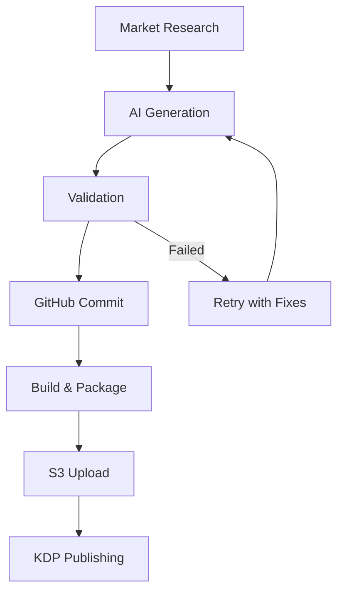

# Firebase AI Implementation Plan for KindleMint Engine

## 🎯 Executive Summary

Transform KindleMint Engine into a scalable, monitored, AI-powered publishing platform using Firebase's latest capabilities while maintaining focus on revenue-generating features.

## 📋 Priority Implementation Checklist

### Phase 1: Core AI Integration (Week 1-2)

#### 1. Firebase Genkit Endpoint
```python
# /api/suggest-keywords endpoint
from firebase_functions import https_fn
from firebase_genkit import genkit

@https_fn.on_request()
def suggest_keywords(req: https_fn.Request) -> https_fn.Response:
    genre = req.args.get('genre', 'crossword')

    # Use Genkit for prompt orchestration
    keywords = genkit.generate({
        "model": "gemini-pro",
        "prompt": f"Generate 20 high-traffic keywords for {genre} books on Amazon KDP",
        "temperature": 0.7
    })

    # Log to Firestore
    db.collection('keyword_research').add({
        'genre': genre,
        'keywords': keywords,
        'timestamp': firestore.SERVER_TIMESTAMP
    })

    return https_fn.Response(json.dumps(keywords))
```

#### 2. Simple AI-Powered Tasks
- [ ] Title generation: `/api/generate-title`
- [ ] Blurb creation: `/api/generate-blurb`
- [ ] Cover prompt generation: `/api/generate-cover-prompt`

### Phase 2: Monitoring & Reliability (Week 2-3)

#### 1. Firebase Analytics Integration
```python
# Enhanced monitoring wrapper
from firebase_admin import analytics

class MonitoredAIManager(EnhancedAPIManager):
    def generate_text(self, **kwargs):
        start_time = time.time()

        try:
            result = super().generate_text(**kwargs)

            # Log to Firebase Analytics
            analytics.log_event('ai_generation_success', {
                'task_type': kwargs.get('task_name'),
                'model': kwargs.get('model', 'gpt-4'),
                'tokens': result.get('usage', {}).get('total_tokens', 0),
                'latency_ms': (time.time() - start_time) * 1000
            })

            return result

        except Exception as e:
            analytics.log_event('ai_generation_failure', {
                'task_type': kwargs.get('task_name'),
                'error': str(e),
                'error_type': type(e).__name__
            })
            raise
```

#### 2. Firestore Logging
```python
# Comprehensive logging for audit trail
def log_generation_result(book_id, generation_type, result):
    db.collection('generation_logs').add({
        'book_id': book_id,
        'type': generation_type,
        'prompt': result.get('prompt'),
        'response': result.get('response'),
        'model': result.get('model'),
        'tokens': result.get('tokens'),
        'cost': result.get('estimated_cost'),
        'timestamp': firestore.SERVER_TIMESTAMP,
        'success': result.get('success', True)
    })
```

### Phase 3: Rapid Dashboard Prototype (Week 3-4)

#### Firebase Studio Dashboard Components
```yaml
Dashboard Screens:
  1. Overview:
     - Active books in production
     - Revenue metrics (mock data initially)
     - System health indicators

  2. Content Pipeline:
     - Queue status
     - Generation progress
     - Error logs with retry options

  3. Market Analysis:
     - Trending keywords
     - Competition analysis
     - Niche opportunities
```

#### Implementation Steps
1. Create Figma design for dashboard
2. Use Firebase Studio to generate:
   ```
   "Create a dashboard with authentication, showing book production status,
   AI generation logs, and market analysis data from Firestore"
   ```
3. Connect to existing Firestore collections

### Phase 4: Production Hardening (Week 4-5)

#### 1. Firebase Studio Agents
```javascript
// Daily market analysis agent
const dailyMarketAnalysis = functions.pubsub
  .schedule('every day 09:00')
  .onRun(async (context) => {
    // Scrape Reddit for trends
    const trends = await scrapeRedditTrends();

    // Analyze with AI
    const analysis = await genkit.generate({
      model: "gemini-pro",
      prompt: `Analyze these Reddit discussions for KDP opportunities: ${trends}`
    });

    // Store results
    await db.collection('market_analysis').add({
      date: new Date(),
      trends: trends,
      analysis: analysis,
      opportunities: analysis.opportunities
    });

    // Notify via Slack
    await notifySlack('Daily market analysis complete', analysis.summary);
  });
```

#### 2. Full Production Loop


## 🚀 Quick Wins Implementation

### Week 1: Immediate Value
1. **Genkit Keyword Endpoint**
   ```bash
   npm install @genkit/genkit @genkit/firebase
   firebase deploy --only functions:suggestKeywords
   ```

2. **Basic Monitoring**
   ```python
   # Add to existing api_manager.py
   firebase_admin.initialize_app()
   analytics = firebase_admin.analytics()
   ```

### Week 2: Enhanced Capabilities
1. **Scheduled Agents**
   - Daily trend analysis
   - Weekly performance reports
   - Auto-retry failed generations

2. **Firestore History**
   - All Claude/GPT outputs logged
   - Market analysis archived
   - Error patterns tracked

## 💡 Revenue-Focused Features Only

### Keep
- ✅ Paperback generation (proven revenue)
- ✅ Market research automation
- ✅ AI content generation
- ✅ Quality validation

### Prune
- ❌ Complex hardcover workflows (unless proven profitable)
- ❌ Over-engineered features
- ❌ Manual processes that can be automated

## 📊 Success Metrics

Track these in Firebase Analytics:
1. **Generation Success Rate**: >95% target
2. **Average Generation Time**: <30 seconds
3. **Cost per Book**: <$0.50 in AI costs
4. **Time to Market**: <2 hours from idea to KDP

## 🔧 Technical Requirements

### Package Updates
```json
{
  "dependencies": {
    "@genkit/genkit": "^0.5.0",
    "@genkit/firebase": "^0.5.0",
    "firebase-admin": "^12.0.0",
    "firebase-functions": "^4.5.0"
  }
}
```

### Environment Variables
```bash
# .env additions
FIREBASE_PROJECT_ID=kindlemint-engine
GENKIT_ENV=production
FIRESTORE_EMULATOR_HOST=localhost:8080  # for local testing
```

## 🎯 30-Day Success Criteria

By end of implementation:
1. **3 AI endpoints deployed** and serving requests
2. **Dashboard showing** real-time generation status
3. **All AI calls logged** to Firestore
4. **Daily agent running** market analysis
5. **Full automation loop** from research to KDP

## Next Immediate Actions

1. **Today**: Install Firebase SDK and Genkit
2. **Tomorrow**: Deploy first keyword suggestion endpoint
3. **This Week**: Set up Firestore logging
4. **Next Week**: Build dashboard with Firebase Studio

Remember: Focus on what generates revenue. Every feature should directly contribute to publishing more profitable books faster.
