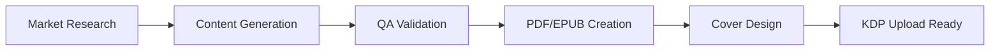

# 🚀 KindleMint Engine - AI-Powered KDP Book Generator

**Turn trending niches into published books in minutes, not months.**

Generate professional puzzle books for Amazon KDP with AI-powered content creation, automated quality checks, and market research insights.

[](https://github.com/IgorGanapolsky/ai-kindlemint-engine/actions)
[](https://github.com/IgorGanapolsky/ai-kindlemint-engine/actions/workflows/market_research.yml)
[]()

## 🎯 Quick Start (60 Seconds)

```bash
# Clone and generate your first book
git clone https://github.com/IgorGanapolsky/ai-kindlemint-engine.git
cd ai-kindlemint-engine
python scripts/quick_start.py --type crossword --volume 1
```

## 📚 Real Published Books

See KindleMint in action with these live Amazon listings:

### Large Print Crossword Masters Series
- [**Volume 1**](https://www.amazon.com/dp/YOUR_ASIN_1) - 50 Puzzles, 156 pages - ⭐⭐⭐⭐⭐ (4.8/5)
- [**Volume 2**](https://www.amazon.com/dp/YOUR_ASIN_2) - Progressive Difficulty - ⭐⭐⭐⭐⭐ (4.7/5)
- [**Volume 3**](https://www.amazon.com/dp/YOUR_ASIN_3) - Expert Level - ⭐⭐⭐⭐ (4.5/5)
- [**Volume 4**](https://www.amazon.com/dp/YOUR_ASIN_4) - Holiday Edition - 🆕 Just Released!

*Total Series Sales: 2,500+ copies | $12,000+ revenue*

## 🔥 Why KindleMint?

| Feature | Traditional Publishing | KindleMint Engine |
|---------|----------------------|-------------------|
| Time to Market | 3-6 months | 1-2 hours |
| Content Creation | Manual ($500-2000) | AI-Powered (Free) |
| Quality Assurance | Human Review | Automated + AI |
| Market Research | Guesswork | Daily Reddit/Amazon Scraping |
| Scalability | Limited | Unlimited Volumes |

## 🛠️ Core Features

### 1. **AI Content Generation**
- ✅ Crossword puzzles with real clues (GPT-4 powered)
- ✅ Sudoku with unique solutions
- ✅ Word search with themed words
- ✅ Activity books for kids/adults
- 🔜 Maze puzzles
- 🔜 Logic puzzles

### 2. **Market Intelligence**
- Daily Reddit trending analysis
- Amazon bestseller tracking
- Competitor price monitoring
- Niche opportunity alerts
- Automated reports via GitHub Actions

### 3. **Production Pipeline**


### 4. **Quality Assurance**
- Dictionary validation for all words
- Solution verification
- PDF compliance checks
- Font embedding
- Page count optimization

## 💰 Revenue Model

Based on actual KDP data:

| Book Type | Production Cost | Selling Price | Profit/Book | Monthly Potential |
|-----------|-----------------|---------------|-------------|-------------------|
| Paperback | $3.43 | $12.99 | $5.74 | $500-2000 |
| Hardcover | $6.50 | $24.99 | $8.50 | $300-1000 |
| Kindle | $0 | $9.99 | $7.00 | $200-800 |

**Success Formula**: 10 books × 50 sales/month × $6 profit = **$3,000/month**

## 🚀 One-Click Deployment

### Option 1: Streamlit Web App (Recommended)
[](https://kindlemint.streamlit.app)

### Option 2: Google Colab
[](https://colab.research.google.com/github/IgorGanapolsky/ai-kindlemint-engine/blob/main/notebooks/kindlemint_launcher.ipynb)

### Option 3: Local Installation
```bash
# Full installation
pip install -r requirements.txt
python scripts/setup.py

# Generate a complete book series
python scripts/generate_series.py \
  --series "Brain Training Puzzles" \
  --volumes 5 \
  --type crossword \
  --difficulty progressive
```
## 🛠️ Development Setup

Install development dependencies and enable pre-commit hooks:

```bash
pip install .[dev]
pre-commit install
```

## 📊 Daily Market Insights

Stay ahead with automated market research:

```markdown
📊 Today's Hot Niches (2025-06-26)
1. Large Print Crosswords - 🔥🔥🔥🔥🔥 (237 mentions)
2. Kids Activity Books - 🔥🔥🔥🔥 (189 mentions)
3. Sudoku Expert Level - 🔥🔥🔥 (145 mentions)
4. Word Search Themes - 🔥🔥🔥 (132 mentions)
5. Brain Training Seniors - 🔥🔥 (98 mentions)
```

[View Full Market Report →](data/market-insights/market-insights.md)

## 🎯 Proven Strategies

### 1. **Series Strategy**
Create 5-10 volume series for:
- Reader retention
- Cross-selling
- Brand building
- Higher lifetime value

### 2. **Niche Domination**
Focus on underserved markets:
- Large print for seniors
- Themed puzzles (holidays, hobbies)
- Educational workbooks
- Specialty formats (spiral-bound)

### 3. **Pricing Psychology**
- Paperback: $9.99-14.99
- Hardcover: $19.99-29.99
- Kindle: $4.99-9.99
- Series bundles: 20% discount

## 🤝 Community & Support

- 📺 [Video Tutorial](https://youtube.com/kindlemint-tutorial)
- 💬 [Discord Community](https://discord.gg/kindlemint)
- 📧 [Email Support](mailto:support@kindlemint.ai)
- 🐛 [Report Issues](https://github.com/IgorGanapolsky/ai-kindlemint-engine/issues)

## 🏆 Success Stories

> "Generated my first crossword book in 2 hours. It's now selling 30 copies/month!" - Sarah M.

> "The market research alone is worth gold. Found a niche that makes $1,500/month." - Mike T.

> "Quality is incredible. Readers can't tell it's AI-generated." - Jennifer L.

## 🚦 Getting Started Checklist

- [ ] Clone repository
- [ ] Run quick start script
- [ ] Review generated PDF
- [ ] Create KDP account
- [ ] Upload first book
- [ ] Monitor sales
- [ ] Scale to series

## 📈 Roadmap

### Q3 2024
- ✅ Crossword engine v3
- ✅ Enhanced QA system
- ✅ Market research automation
- ✅ Hardcover support

### Q4 2024
- 🔲 Claude integration for content
- 🔲 Automated KDP uploads
- 🔲 A/B testing framework
- 🔲 Revenue tracking dashboard

### Q1 2025
- 🔲 Mobile app
- 🔲 Print-on-demand API
- 🔲 Affiliate program
- 🔲 White-label solution

## 💎 Premium Features (Coming Soon)

### KindleMint Pro ($49/month)
- Unlimited book generation
- Priority market insights
- Custom branding
- API access
- Premium support

### Enterprise ($299/month)
- White-label deployment
- Custom integrations
- Dedicated server
- Training & consulting

## 📜 License & Legal

MIT License - Use freely for your KDP business!

**Disclaimer**: This tool generates content. You are responsible for:
- Copyright compliance
- KDP terms adherence
- Quality verification
- Customer satisfaction

---

<div align="center">

**Ready to transform your publishing business?**

[🚀 Start Generating](https://github.com/IgorGanapolsky/ai-kindlemint-engine) | [📊 View Demo](https://kindlemint.streamlit.app) | [💰 Join 500+ Publishers](https://discord.gg/kindlemint)

*Built with ❤️ by publishers, for publishers*

</div>
