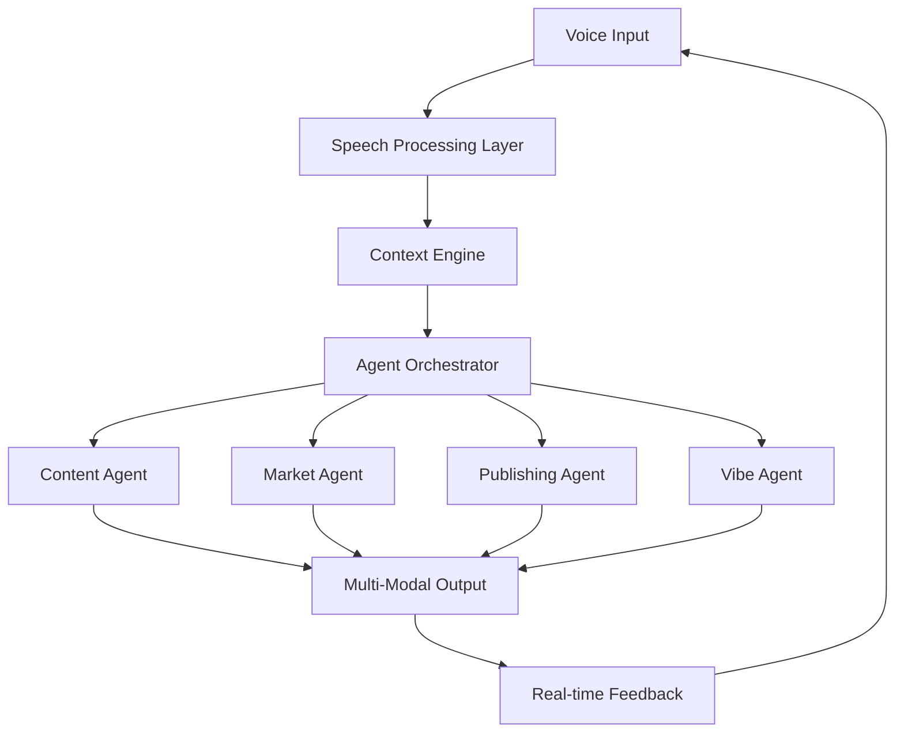

# Voice-to-Book Pipeline Architecture Design

## Executive Summary

This document outlines the architectural design for KindleMint's revolutionary voice-to-book pipeline, implementing the "vibecoding" concept from The AI Daily Brief. The system enables users to speak books into existence through natural conversation with AI agents.

## Architecture Overview



## Core Components

### 1. Speech Processing Layer

#### Voice Input Handler
```python
class VoiceInputHandler:
    """Processes raw audio input with emotion and intent detection"""
    
    def __init__(self):
        self.transcription_engine = WhisperTranscriber()
        self.emotion_detector = EmotionAnalyzer()
        self.intent_classifier = IntentClassifier()
        self.voice_profile = VoiceProfileManager()
    
    async def process_voice_input(self, audio_stream) -> VoiceInput:
        # Real-time transcription with emotion analysis
        transcription = await self.transcription_engine.transcribe(audio_stream)
        emotions = await self.emotion_detector.analyze(audio_stream)
        intent = await self.intent_classifier.classify(transcription)
        
        return VoiceInput(
            text=transcription.text,
            confidence=transcription.confidence,
            emotions=emotions,
            intent=intent,
            voice_characteristics=self.voice_profile.extract_features(audio_stream)
        )
```

#### Emotion Detection Engine
```python
class EmotionAnalyzer:
    """Analyzes emotional context from voice patterns"""
    
    async def analyze(self, audio_stream) -> EmotionProfile:
        # Multi-modal emotion detection
        vocal_emotions = self._analyze_vocal_patterns(audio_stream)
        linguistic_emotions = self._analyze_linguistic_content(audio_stream)
        
        return EmotionProfile(
            primary_emotion=vocal_emotions.primary,
            intensity=vocal_emotions.intensity,
            secondary_emotions=vocal_emotions.secondary,
            mood=self._determine_creative_mood(vocal_emotions, linguistic_emotions),
            energy_level=vocal_emotions.energy,
            creative_intent=linguistic_emotions.creative_markers
        )
```

### 2. Context Engine

#### Author Context Builder
```python
class AuthorContextBuilder:
    """Builds and maintains comprehensive author context"""
    
    def __init__(self):
        self.memory_store = AuthorMemoryStore()
        self.preference_engine = PreferenceEngine()
        self.writing_style_analyzer = WritingStyleAnalyzer()
    
    async def build_context(self, user_id: str, voice_input: VoiceInput) -> AuthorContext:
        # Retrieve and update author profile
        profile = await self.memory_store.get_author_profile(user_id)
        
        # Analyze current session context
        session_context = self._analyze_session_context(voice_input)
        
        # Update writing style profile
        style_updates = await self.writing_style_analyzer.analyze_input(voice_input)
        profile.writing_style.update(style_updates)
        
        return AuthorContext(
            user_id=user_id,
            writing_style=profile.writing_style,
            preferences=profile.preferences,
            past_works=profile.past_works,
            success_patterns=profile.success_patterns,
            current_mood=voice_input.emotions.mood,
            session_intent=session_context.intent,
            creative_energy=voice_input.emotions.energy_level
        )
```

#### Context Synthesis Engine
```python
class ContextSynthesisEngine:
    """Synthesizes multiple context layers for optimal content generation"""
    
    def __init__(self):
        self.author_context = AuthorContextBuilder()
        self.market_context = MarketContextAnalyzer()
        self.creative_context = CreativeContextLibrary()
        self.publishing_context = PublishingContextEngine()
    
    async def synthesize_context(self, voice_input: VoiceInput, user_id: str) -> SynthesizedContext:
        # Parallel context building
        author_ctx = await self.author_context.build_context(user_id, voice_input)
        market_ctx = await self.market_context.get_relevant_context(voice_input.intent)
        creative_ctx = await self.creative_context.match_patterns(voice_input)
        publishing_ctx = await self.publishing_context.optimize_for_platforms(voice_input.intent)
        
        # Context fusion with attention weighting
        return SynthesizedContext(
            author=author_ctx,
            market=market_ctx,
            creative=creative_ctx,
            publishing=publishing_ctx,
            synthesis_weights=self._calculate_attention_weights(voice_input)
        )
```

### 3. Agent Orchestrator

#### Vibecoding Orchestrator
```python
class VibecodeOrchestrator:
    """Orchestrates the vibecoding experience across multiple agents"""
    
    def __init__(self):
        self.agent_registry = AgentRegistry()
        self.workflow_engine = WorkflowEngine()
        self.real_time_processor = RealTimeProcessor()
    
    async def process_vibecode_input(self, voice_input: VoiceInput, context: SynthesizedContext) -> VibecodeResponse:
        # Determine optimal agent workflow
        workflow = await self.workflow_engine.design_workflow(voice_input, context)
        
        # Execute workflow with real-time feedback
        response = await self._execute_vibecode_workflow(workflow, voice_input, context)
        
        return response
    
    async def _execute_vibecode_workflow(self, workflow: Workflow, voice_input: VoiceInput, context: SynthesizedContext):
        # Initialize agent tasks
        tasks = []
        
        # Content generation with vibe matching
        if workflow.requires_content_generation:
            content_task = create_vibecode_content_task(voice_input, context)
            tasks.append(content_task)
        
        # Market optimization in real-time
        if workflow.requires_market_optimization:
            market_task = create_market_optimization_task(voice_input, context)
            tasks.append(market_task)
        
        # Publishing format selection
        if workflow.requires_format_optimization:
            publishing_task = create_publishing_optimization_task(voice_input, context)
            tasks.append(publishing_task)
        
        # Execute tasks with agent coordination
        results = await self.agent_registry.execute_coordinated_tasks(tasks)
        
        # Synthesize results into vibecode response
        return self._synthesize_vibecode_response(results, voice_input, context)
```

### 4. Specialized Agents

#### Vibe Agent
```python
class VibeAgent(BaseAgent):
    """Specialized agent for understanding and translating creative vibes"""
    
    def __init__(self):
        super().__init__(
            agent_type="vibe_agent",
            capabilities=[
                AgentCapability.VIBE_INTERPRETATION,
                AgentCapability.MOOD_TRANSLATION,
                AgentCapability.CREATIVE_RESONANCE
            ]
        )
        self.vibe_translator = VibeTranslator()
        self.mood_mapper = MoodMapper()
    
    async def _execute_task(self, task: Task) -> TaskResult:
        if task.task_type == TaskType.INTERPRET_VIBE:
            return await self._interpret_creative_vibe(task)
        elif task.task_type == TaskType.TRANSLATE_MOOD:
            return await self._translate_mood_to_content(task)
        elif task.task_type == TaskType.MATCH_RESONANCE:
            return await self._match_creative_resonance(task)
    
    async def _interpret_creative_vibe(self, task: Task) -> TaskResult:
        voice_input = task.input_data['voice_input']
        context = task.input_data['context']
        
        # Analyze the creative vibe from voice patterns
        vibe_analysis = await self.vibe_translator.analyze_vibe(
            emotions=voice_input.emotions,
            voice_characteristics=voice_input.voice_characteristics,
            linguistic_patterns=voice_input.text,
            author_context=context.author
        )
        
        # Generate vibe-matched content guidelines
        content_guidelines = await self._generate_content_guidelines(vibe_analysis)
        
        return TaskResult(
            success=True,
            task_id=task.task_id,
            output_data={
                'vibe_analysis': vibe_analysis,
                'content_guidelines': content_guidelines,
                'creative_direction': self._synthesize_creative_direction(vibe_analysis)
            }
        )
```

#### Voice-Aware Content Agent
```python
class VoiceContentAgent(BaseAgent):
    """Content generation agent optimized for voice-driven creation"""
    
    def __init__(self):
        super().__init__(
            agent_type="voice_content_agent",
            capabilities=[
                AgentCapability.CONTENT_GENERATION,
                AgentCapability.VOICE_STYLE_MATCHING,
                AgentCapability.REAL_TIME_GENERATION
            ]
        )
        self.voice_style_matcher = VoiceStyleMatcher()
        self.conversational_generator = ConversationalGenerator()
    
    async def _execute_task(self, task: Task) -> TaskResult:
        if task.task_type == TaskType.GENERATE_FROM_VOICE:
            return await self._generate_voice_driven_content(task)
    
    async def _generate_voice_driven_content(self, task: Task) -> TaskResult:
        voice_input = task.input_data['voice_input']
        context = task.input_data['context']
        vibe_guidelines = task.input_data.get('vibe_guidelines', {})
        
        # Match voice patterns to writing style
        style_profile = await self.voice_style_matcher.match_style(
            voice_input.voice_characteristics,
            context.author.writing_style
        )
        
        # Generate content that resonates with spoken intent
        content = await self.conversational_generator.generate(
            intent=voice_input.intent,
            style_profile=style_profile,
            vibe_guidelines=vibe_guidelines,
            market_context=context.market,
            creative_context=context.creative
        )
        
        return TaskResult(
            success=True,
            task_id=task.task_id,
            output_data={
                'generated_content': content,
                'style_profile': style_profile,
                'voice_resonance_score': self._calculate_resonance_score(voice_input, content)
            }
        )
```

### 5. Real-Time Feedback System

#### Conversational Feedback Loop
```python
class ConversationalFeedbackLoop:
    """Enables real-time conversation and refinement during book creation"""
    
    def __init__(self):
        self.feedback_analyzer = FeedbackAnalyzer()
        self.content_refiner = ContentRefiner()
        self.suggestion_engine = SuggestionEngine()
    
    async def process_feedback(self, user_feedback: VoiceInput, current_state: BookCreationState) -> FeedbackResponse:
        # Analyze the feedback intent and sentiment
        feedback_analysis = await self.feedback_analyzer.analyze(user_feedback, current_state)
        
        # Generate suggestions based on feedback
        suggestions = await self.suggestion_engine.generate_suggestions(
            feedback_analysis,
            current_state
        )
        
        # Apply refinements if requested
        if feedback_analysis.requires_refinement:
            refined_content = await self.content_refiner.refine(
                current_content=current_state.content,
                feedback=feedback_analysis,
                user_preferences=current_state.context.author.preferences
            )
            current_state.content = refined_content
        
        return FeedbackResponse(
            understood_intent=feedback_analysis.intent,
            applied_changes=feedback_analysis.requires_refinement,
            suggestions=suggestions,
            updated_state=current_state,
            conversational_response=self._generate_conversational_response(feedback_analysis)
        )
```

### 6. Integration with Existing Pipeline

#### Vibecode to Publishing Bridge
```python
class VibecodePublishingBridge:
    """Bridges vibecode creation with existing publishing pipeline"""
    
    def __init__(self):
        self.format_optimizer = FormatOptimizer()
        self.qa_integrator = QAIntegrator()
        self.publishing_pipeline = PublishingPipeline()
    
    async def convert_vibecode_to_book(self, vibecode_session: VibecodeSession) -> PublishingResult:
        # Extract structured content from vibecode session
        structured_content = await self._extract_structured_content(vibecode_session)
        
        # Optimize for target publishing formats
        optimized_content = await self.format_optimizer.optimize(
            content=structured_content,
            target_formats=vibecode_session.target_formats,
            market_preferences=vibecode_session.context.market
        )
        
        # Integrate with existing QA pipeline
        qa_validated_content = await self.qa_integrator.validate_vibecode_content(
            optimized_content,
            vibecode_session.quality_requirements
        )
        
        # Execute publishing pipeline
        publishing_result = await self.publishing_pipeline.execute(
            content=qa_validated_content,
            metadata=vibecode_session.metadata,
            publishing_options=vibecode_session.publishing_options
        )
        
        return publishing_result
```

## Data Models

### Voice Input Models
```python
@dataclass
class VoiceInput:
    text: str
    confidence: float
    emotions: EmotionProfile
    intent: Intent
    voice_characteristics: VoiceCharacteristics
    timestamp: datetime
    session_id: str

@dataclass
class EmotionProfile:
    primary_emotion: str
    intensity: float
    secondary_emotions: List[str]
    mood: str
    energy_level: float
    creative_intent: List[str]

@dataclass
class VoiceCharacteristics:
    tone: str
    pace: float
    emphasis_patterns: List[str]
    speech_markers: Dict[str, Any]
    personality_indicators: Dict[str, float]
```

### Context Models
```python
@dataclass
class AuthorContext:
    user_id: str
    writing_style: WritingStyleProfile
    preferences: UserPreferences
    past_works: List[WorkProfile]
    success_patterns: SuccessPatterns
    current_mood: str
    session_intent: str
    creative_energy: float

@dataclass
class SynthesizedContext:
    author: AuthorContext
    market: MarketContext
    creative: CreativeContext
    publishing: PublishingContext
    synthesis_weights: Dict[str, float]
```

### Vibecode Session Models
```python
@dataclass
class VibecodeSession:
    session_id: str
    user_id: str
    start_time: datetime
    voice_inputs: List[VoiceInput]
    generated_content: Dict[str, Any]
    feedback_history: List[FeedbackResponse]
    context: SynthesizedContext
    target_formats: List[str]
    quality_requirements: QualityRequirements
    publishing_options: PublishingOptions
    metadata: BookMetadata
```

## API Endpoints

### Voice Processing API
```python
@app.post("/api/v1/vibecode/start-session")
async def start_vibecode_session(user_id: str, session_config: SessionConfig) -> VibecodeSession:
    pass

@app.post("/api/v1/vibecode/process-voice")
async def process_voice_input(session_id: str, audio_data: bytes) -> VibecodeResponse:
    pass

@app.post("/api/v1/vibecode/provide-feedback")
async def provide_feedback(session_id: str, feedback_audio: bytes) -> FeedbackResponse:
    pass

@app.get("/api/v1/vibecode/session-status/{session_id}")
async def get_session_status(session_id: str) -> SessionStatus:
    pass

@app.post("/api/v1/vibecode/publish-book")
async def publish_vibecode_book(session_id: str, publishing_options: PublishingOptions) -> PublishingResult:
    pass
```

## Implementation Phases

### Phase 1: Foundation (Weeks 1-4)
- Implement basic voice input processing
- Create emotion detection engine
- Build author context foundation
- Integrate with existing agent system

### Phase 2: Core Vibecoding (Weeks 5-8)
- Implement vibe agent
- Create voice-aware content agent
- Build conversational feedback loop
- Develop real-time processing

### Phase 3: Context Excellence (Weeks 9-12)
- Implement advanced context synthesis
- Create market-aware optimization
- Build publishing format optimization
- Integrate quality assurance

### Phase 4: Production Ready (Weeks 13-16)
- Performance optimization
- Scalability improvements
- User experience refinement
- Production deployment

## Success Metrics

### Technical Metrics
- Voice transcription accuracy: >95%
- Emotion detection accuracy: >85%
- Content generation latency: <3 seconds
- Session completion rate: >90%

### User Experience Metrics
- Time to first book: <30 minutes
- User satisfaction score: >4.5/5
- Session engagement time: >45 minutes
- Return user rate: >70%

### Business Metrics
- Books published via vibecoding: >1000/month
- User conversion rate: >25%
- Platform stickiness: >6 months average
- Revenue per vibecode user: 3x traditional users

## Technology Stack

### Core Technologies
- **Speech Processing**: OpenAI Whisper, Google Speech-to-Text
- **Emotion AI**: Custom emotion detection models
- **Real-time Processing**: WebSockets, AsyncIO
- **Agent Orchestration**: Enhanced BaseAgent system
- **Context Storage**: Vector databases (Pinecone/Weaviate)
- **API Gateway**: FastAPI with WebSocket support

### Integration Points
- **Existing Agent System**: Extend BaseAgent, TaskSystem, MessageProtocol
- **API Manager**: Enhance with speech service integration
- **Publishing Pipeline**: Bridge to existing PDF/EPUB generation
- **QA System**: Integrate with existing validation framework

## Conclusion

This architecture enables KindleMint to become the first publishing platform with true vibecoding capabilities, allowing users to speak books into existence through natural conversation with AI. The design leverages existing KindleMint infrastructure while adding revolutionary voice-first creation capabilities.

The system maintains backward compatibility with existing publishing workflows while opening entirely new creative possibilities for users who prefer speaking to typing, thinking to structuring, and vibing to planning.